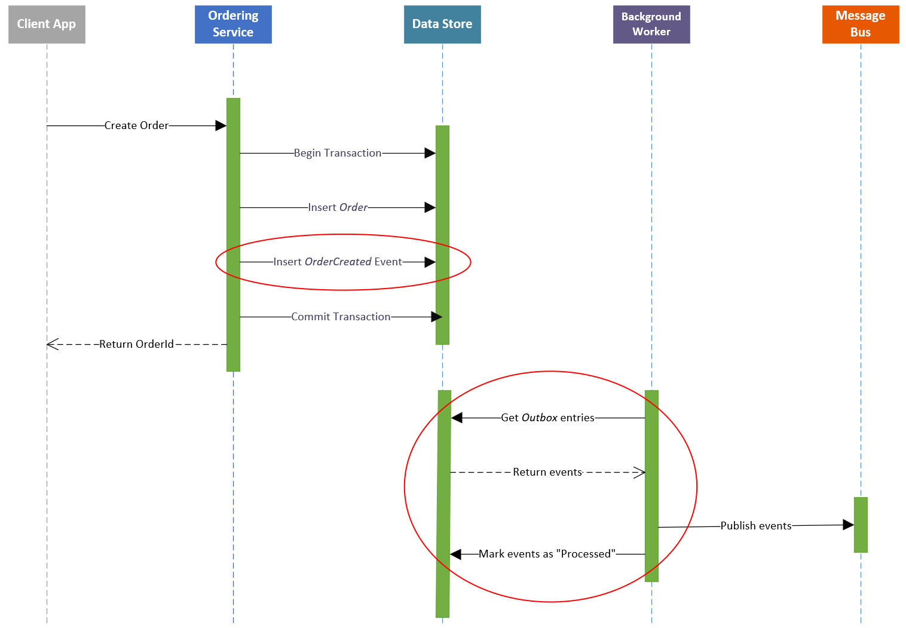

## Transactional outbox pattern



<small>https://learn.microsoft.com/en-us/azure/architecture/best-practices/transactional-outbox-cosmos<small>

---

<!-- .element: class="nested-fragments-highlight-current" -->

## Outbox polling

<div class="viz" data-viz-engine="neato" data-width="900"
    data-viz-images="../image/logo/elasticsearch-color-horizontal.svg,200px,100px">
digraph {
    node [margin = 0.2];
    splines = ortho;

	app [label = "Application", pos = "-3,0!"];
	orm [label = "ORM", labelloc="t", pos = "0,0!"];
	db [shape=cylinder, label = "DB", pos = "3,0!"];

	app -> orm [label = "1. Entity change", headclip = false, arrowhead = none];
	orm -> db [headlabel = "1.1. INSERT/UPDATE", tailclip = false, labeldistance=10, labelangle=-6.0, class="fragment data-fragment-index_1"];

	hsearch [label = "Hibernate Search", pos = "0,-2!"];
    elasticsearch [shape=none, image="../image/logo/elasticsearch-color-horizontal.svg", label="", penwidth=0, pos = "5,-2!"];

	orm -> hsearch:nw [headlabel = "1.2. Change event", style = dashed, tailclip = false, labeldistance=7, labelangle=50.0, class="fragment data-fragment-index_2"];
	orm -> hsearch:n [headlabel = "1.3. Pre-commit event", style = dashed, tailclip = false, labeldistance=1, labelangle=180.0, class="fragment data-fragment-index_3"];
	hsearch -> db [headlabel = "1.3.1 INSERT INTO\nOutboxEvent ...", class="fragment data-fragment-index_3", labeldistance=6, labelangle=40.0];
	orm -> db [headlabel = "1.4. COMMIT", tailclip = false, labeldistance=10, labelangle=6.0, class="fragment data-fragment-index_4"];

	eventProcessor [label = "Event processor\n(Hibernate Search)", pos = "7,0!"];

    pollingSplineRoutingNode [style=invis, pos="4.5,0.6!"];
    commitSplineRoutingNode [style=invis, pos="4.5,-0.6!"];

	eventProcessor:n -> eventProcessor:n [headlabel = "2. Polling", class="fragment data-fragment-index_5"];
	eventProcessor -> pollingSplineRoutingNode [class="fragment data-fragment-index_6", headclip = false, arrowhead = none];
    pollingSplineRoutingNode -> db:ne [taillabel = "2.1. SELECT ... FROM OutboxEvent", class="fragment data-fragment-index_6", tailclip = false, labeldistance=2, labelangle=-120.0];

	eventProcessor -> db [headlabel = "2.4. DELETE FROM OutboxEvent", class="fragment data-fragment-index_9", labeldistance=8, labelangle=-7.0];
	eventProcessor -> db [headlabel = "2.2. SELECT ... FROM MyEntity", class="fragment data-fragment-index_7", labeldistance=8, labelangle=7.0];

	eventProcessor -> commitSplineRoutingNode [class="fragment data-fragment-index_10", headclip = false, arrowhead = none];
    commitSplineRoutingNode -> db:se [taillabel = "2.5. COMMIT", class="fragment data-fragment-index_10", tailclip = false];

	eventProcessor -> elasticsearch [label = "2.3. PUT /book/_doc/1/", class="fragment data-fragment-index_8"];
}
</div>

@Notes:

1. Developer asks Hibernate ORM to persist entity changes
1. Hibernate ORM notifies Hibernate Search of changes (through a listener);
   Hibernate Search accumulates change events in the session
1. Before commit, Hibernate ORM notifies Hibernate Search again
1. Then Hibernate Search persists event in the database (in the same transaction)
1. The transaction gets committed
1. An event processor regularly polls the DB
1. It detects a new event
1. The event processor loads the entity to reindex
1. The event processor send the indexing request to Elasticsearch
1. Once indexing is done, the event processor deletes the event and commits
1. Indexing before commit means we don't lose events if indexing fails

-

## No event loss

```sql
BEGIN TRANSACTION;
UPDATE myentity SET name = 'updated' WHERE id = 42;
INSERT INTO hsearch_outboxevent (entity_name, entity_id, <...>)
    VALUES ('MyEntity', '42', <...>);
COMMIT TRANSACTION;
```

@Notes:

1. A single transaction: either we persist the change AND the new event, either they are BOTH rolled back
2. Once the event is persisted, it's preserved until it's processed successfully

-

## Minimized latency

<div class="viz" data-width="900">
digraph {
    node [shape = record, style = rounded, margin = 0.2];
	rankdir = LR;

    request [label = "HTTP\nrequest"];
    entityUpdate [label = "Entity\nchange"];
    indexingResolution [label = "Resolution of\nentities to reindex"];

    # Note the "cluster" prefix is necessary to have the subgraph drawn.
    subgraph clusterMinimalLatency {
        label = "Minimized latency";
        style = rounded;
        class = "highlight";

        eventInsert [label = "INSERT INTO\nOutboxEvent ..."];
    }

    subgraph clusterMediumLatency {
        label = "Traditional latency";
        style = rounded;
        node [style = dashed];

        indexingLoad [label = "SELECT ...\nSELECT ..."];
        indexing [label = "Indexing"];
    }

    response [label = "HTTP\nresponse"];

    request -> entityUpdate;
    entityUpdate -> indexingResolution;
    indexingResolution -> eventInsert;
    indexingResolution -> indexingLoad [style = dashed];
    indexingLoad -> indexing [style = dashed];
    eventInsert -> response;
    indexing -> response [style = dashed];
}
</div>

@Notes:

1. No loading of enormous entity graphs for indexing, at least in the application's HTTP request threads 
2. Indexing can scale independently thanks to sharding:
   100 HTTP threads + 1 indexing thread or 100 HTTP threads + 10 indexing threads or ...

-

<!-- .element data-visibility="hidden" -->

## Conflicts

<div class="grid">
<div class="column">
<div class="viz">
digraph {
	node [margin = 0.2, shape = record, style = rounded];
	rankdir = TB;

	entity1 [label = "Book"];
	entity2 [label = "Author 1 (v2)", color = "red"];
	entity3 [label = "Author 2"];
	entity1 -> entity2;
	entity1 -> entity3;
}
</div>
</div>

<div class="column" style="font-size: 3em;">
&rarr;
</div>

<div class="column">
<div class="viz">
digraph {
	node [margin = 0.6, shape = note];

	document [label = "Single document (Author 1 v2)"];
}
</div>
</div>
</div>

<div class="grid">
<div class="column">
<div class="viz">
digraph {
	node [margin = 0.2, shape = record, style = rounded];
	rankdir = TB;

	entity1 [label = "Book"];
	entity2 [label = "Author 1"];
	entity3 [label = "Author 2 (v2)"];
	entity1 -> entity2;
	entity1 -> entity3;
}
</div>
</div>

<div class="column" style="font-size: 3em;">
&rarr;
</div>

<div class="column">
<div class="viz">
digraph {
	node [margin = 0.6, shape = note];

	document [label = "Single document (Author 2 v2)"];
}
</div>
</div>
</div>

DB conflict != Index conflict

@Notes:

* In rare cases, it's theoretically possible to get out of sync in case of concurrent changes
* Two concurrent changes to two separate entities, so no DB conflict
* No Elasticsearch transaction, so no conflict either
* In practice, rare and not critical (reindex every night)
* But still

-

<!-- .element data-visibility="hidden" -->

## Résoudre à l'aide d'une version ?

```java
@Entity
@Indexed
public class Book {
    @Version
    private long version;

   // ...
}
```

```java
if (needsIndexing(book)) {
	entityManager.lock(book, LockModeType.OPTIMISTIC_FORCE_INCREMENT);
}
```
```
PUT my-index-000001/_doc/1?version=${book.getVersion()}&version_type=external
```

@Notes:

1. Elasticsearch does not support transactions but does support optimistic concurrency control
2. Consists in maintaining a version in the document to detect concurrent changes
3. Coupled to the same feature in Hibernate ORM, this could work...
4. ... but implies more concurrent access on the same table
5. ... and do we really want to roll back a transaction for a simple indexing problem?

-

## No conflicts

<div class="viz" data-width="900">
digraph {
	rankdir = LR;
    compound=true;

    node [style = rounded, margin = 0.2];

    application1 [label = "Application\ninstance 1"];
    application2 [label = "Application\ninstance 2"];

    application1 -> shard1 [lhead = clusterOutbox, label = "Event for\nentity id=12"]
    application1 -> shard2 [lhead = clusterOutbox, label = "Event for\nentity id=42", class = "highlight"]
    application2 -> shard2 [lhead = clusterOutbox, label = "Event for\nentity id=42", class = "highlight"]
    application2 -> shard3 [lhead = clusterOutbox, label = "Event for\nentity id=35"]

    # Note the "cluster" prefix is necessary to have the subgraph drawn.
	subgraph clusterOutbox {
        label = "Outbox table (DB)";
        labelloc = tl;
        style = rounded;

		shard1 [label = "Shard 1", shape = record];
		shard2 [label = "Shard 2", shape = record];
		shard3 [label = "Shard 3", shape = record];
	}

    shard1 -> processor1 [label = "Events for\nentity id=12"]
    shard2 -> processor2 [label = "Events for\nentity id=42", class = "highlight"]
    shard3 -> processor3 [label = "Events for\nentity id=35"]

    processor1 [label = "Event\nprocessor 1"];
    processor2 [label = "Event\nprocessor 2"];
    processor3 [label = "Event\nprocessor 3"];

    entityTable [label = "Entity table\n(DB)", shape = record];

    processor1 -> entityTable [dir = back, label = "Data for\nentity id=12"]
    processor2 -> entityTable [dir = back, label = "Data for\nentity id=42", class = "highlight"]
    processor3 -> entityTable [dir = back, label = "Data for\nentity id=35"]
}
</div>

@Notes:

* Before
  * In rare cases, it's theoretically possible to get out of sync in case of concurrent changes
  * Two concurrent changes to two separate entities, so no DB conflict
  * No Elasticsearch transaction, so no conflict either
  * In practice, rare and not critical (reindex every night)
  * But still
* After
  * No concurrent indexing of a given entity:
    distribution of entities to reindex among event processors according to their ID (*sharding*)
  * No data conflict between event:
    we get fresh data from a new transaction.
    Worst case, we reindex twice, and the second time data include both changes.

-

<!-- .element: class="grid" -->
## No additional infrastructure

<div class="column">
<div class="viz" data-viz-engine="neato" data-viz-images="../image/logo/elasticsearch-color-horizontal.svg,200px,100px">
digraph {
	node [margin = 0.2];

	app [label = "Application", pos = "0,0!"];
	db [shape=cylinder, label = "DB", pos = "2,0!"];
    elasticsearch [shape=none, image="../image/logo/elasticsearch-color-horizontal.svg", label="", penwidth=0, pos = "1,-1!"];
}
</div>
</div>

<div class="column" style="font-size: 3em;">
&rarr;
</div>

<div class="column">
<div class="viz" data-viz-engine="neato" data-viz-images="../image/logo/elasticsearch-color-horizontal.svg,200px,100px">
digraph {
	node [margin = 0.2];

	app [label = "Application", pos = "0,0!"];
	db [shape=cylinder, label = "DB", pos = "2,0!"];
    elasticsearch [shape=none, image="../image/logo/elasticsearch-color-horizontal.svg", label="", penwidth=0, pos = "1,-1!"];
}
</div>
</div>

@Notes:

* le polling implique un usage légèrement plus important de la BDD
* mais en échange, on n'a besoin de configurer un autre élément d'infra: on utilise la même BDD
